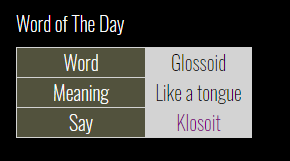

# WWW-WOTD
Word of the day for MagicMirror2 

## Great for Kids to learn new words!

* Examples for top left 
* CSS provided for coloring and sizing. Make it your own.
* Use updateInterval to reload as often as you'd like!

## Examples

Using top left for position



## Installation and requirements

* `git clone https://github.com/cowboysdude/WWW-WOTD` into the `~/MagicMirror/modules` directory.

* go to 'modules/MMM-WOTD' directory and run 'npm install'

## Config.js entry and options

```
{
    disabled: false,
    module: "MMM-WOTD",
    position: "top left", 
    config: {
        word: 'white',     // word font color
        definition: 'white', // definition color
        say: 'white',    // pronunciation color
        wbackground: '#52523D',   //word background color -- left hand side
        dbackground: 'lightgray',  //definition, pronounciation etc color -- right hand side
        updateInterval: 5 * 60 * 1000 // update as often as you'd like or use the default -- 1 * 720 * 1000
    }
},
```

## Module assistance in the MagicMirror forum, not here. 

## Language support is not supported this is English only.  
